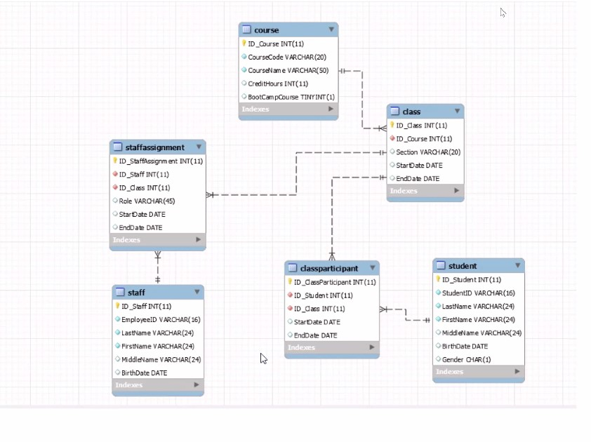
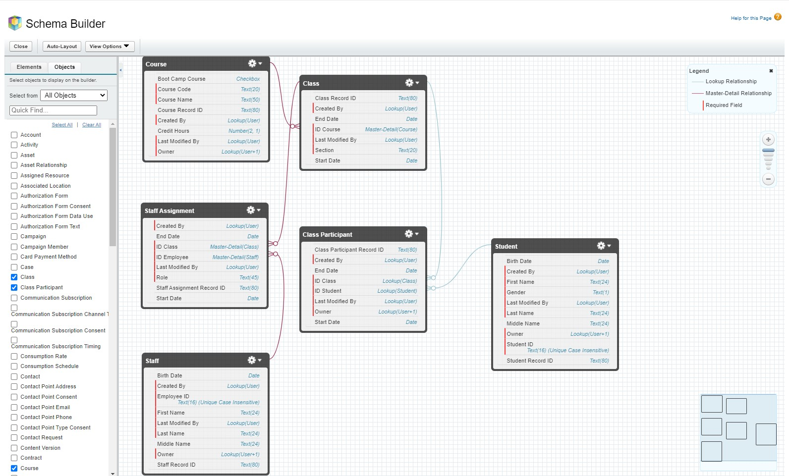
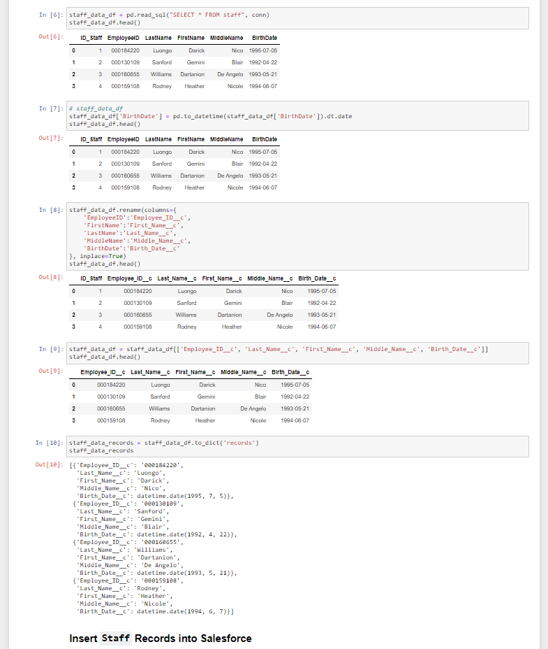
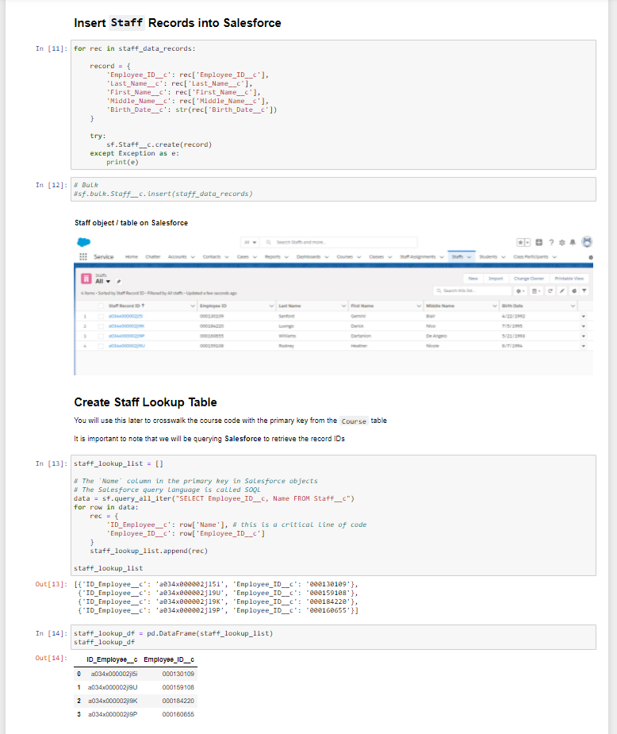
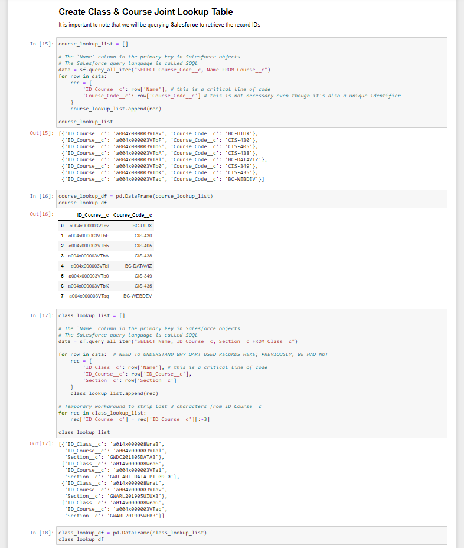
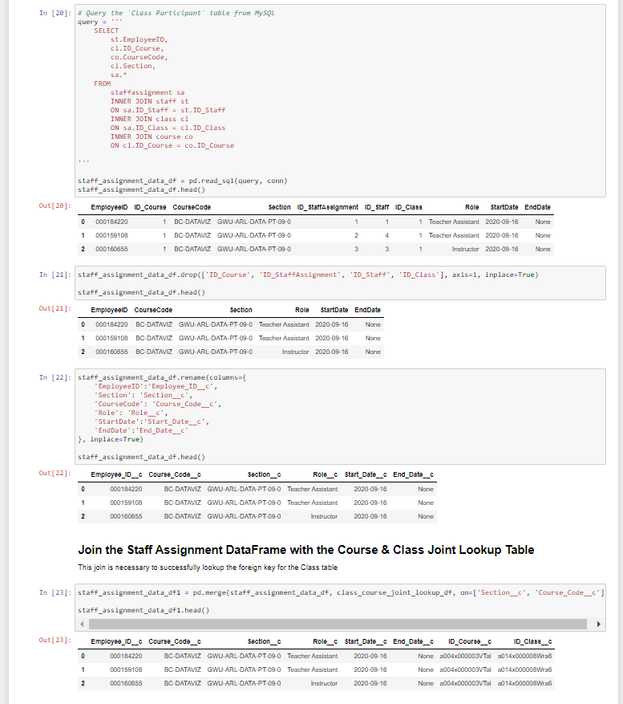
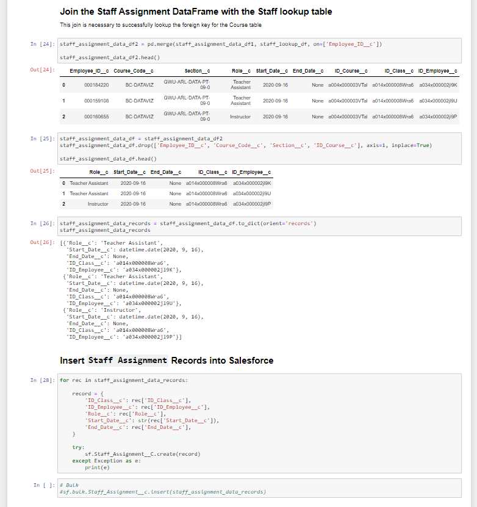
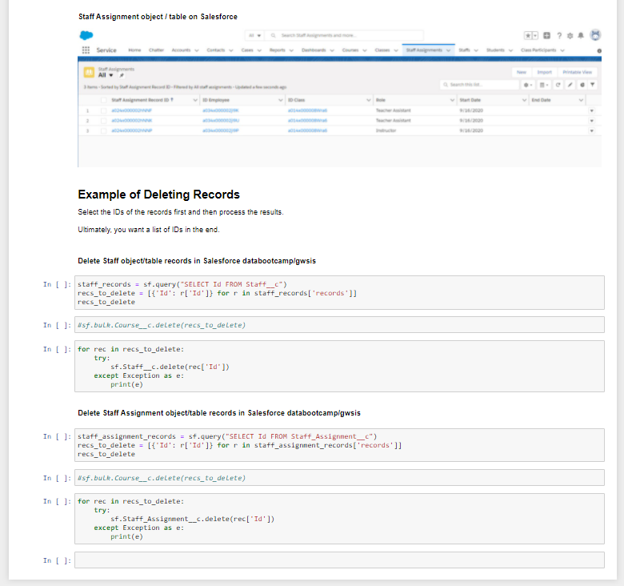
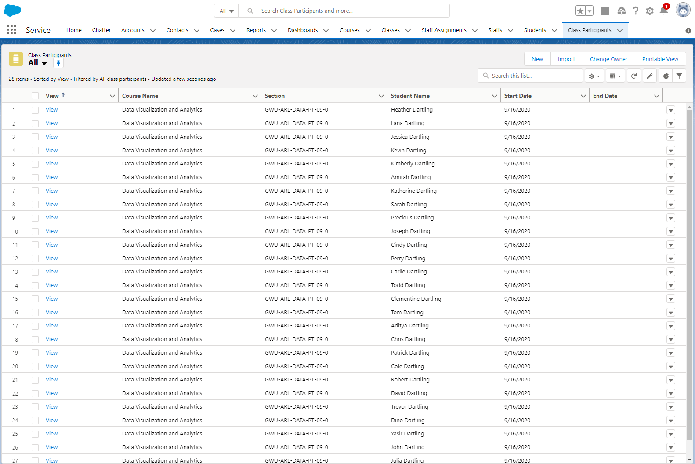

**Student Info System ETL**

Migrated a student information system (GWSIS) from MySQL on AWS to Salesforce,
maintaining referential integrity using data modeling, data integration, and
even configuration of Salesforce

**Live Web Site Link**

The repository does not contain the live website. That website can be reached at
<https://cooperassetmanagement-dev-ed.lightning.force.com/lightning/page/home>.

**MySQL Workbench ERD Diagram Used to Reverse Engineer MySQL on AWS GWSIS
Database**

**  
**

**Salesforce Schema Builder Diagram Used to Generate, Map and Recreate GWSIS
Database Using Salesforce Objects (Tables)**

**  
**

**Python Scripts Used to Effect the ETL – This Particular Section Relating to
Staff & Staff Assignment Tables and the Joint Lookup Tables**

****

**  
**

****

**  
**

****

**  
**

****

**  
**

****

**  
**

****

**  
**

****

**  
**

****

**  
**

**Final Solution Example Table – Class Participants Table in Salesforce GWSIS
Database Post ETL**

